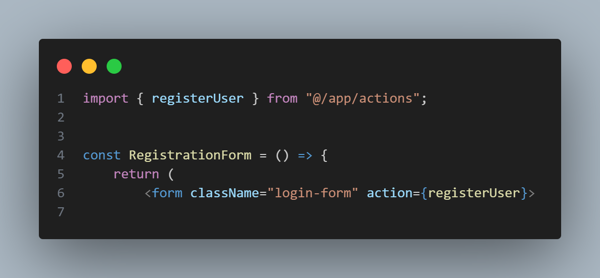
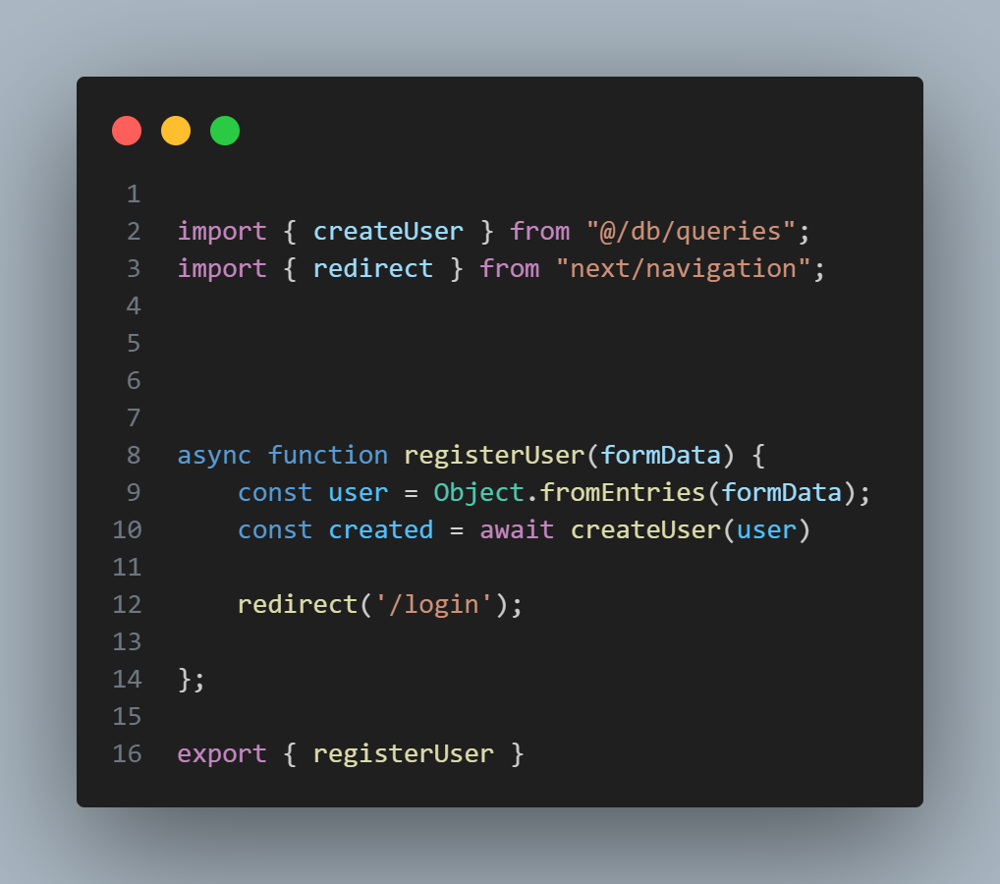

This is a [Next.js](https://nextjs.org/) project bootstrapped with [`create-next-app`](https://github.com/vercel/next.js/tree/canary/packages/create-next-app).

## Getting Started

First, run the development server:

```bash
npm run dev
# or
yarn dev
# or
pnpm dev
# or
bun dev
```

Open [http://localhost:3000](http://localhost:3000) with your browser to see the result.

You can start editing the page by modifying `app/page.js`. The page auto-updates as you edit the file.

This project uses [`next/font`](https://nextjs.org/docs/basic-features/font-optimization) to automatically optimize and load Inter, a custom Google Font.

## Learn More

To learn more about Next.js, take a look at the following resources:

- [Next.js Documentation](https://nextjs.org/docs) - learn about Next.js features and API.
- [Learn Next.js](https://nextjs.org/learn) - an interactive Next.js tutorial.

You can check out [the Next.js GitHub repository](https://github.com/vercel/next.js/) - your feedback and contributions are welcome!

## Deploy on Vercel

The easiest way to deploy your Next.js app is to use the [Vercel Platform](https://vercel.com/new?utm_medium=default-template&filter=next.js&utm_source=create-next-app&utm_campaign=create-next-app-readme) from the creators of Next.js.

Check out our [Next.js deployment documentation](https://nextjs.org/docs/deployment) for more details.

---

## Project Details

project setup and component setup done using tailwindCSS

## MongoDB setup
first create an env file to store mongo uri. after that created a folder called services inside the services folder connect with mongodb. to verify connection stablished in the root layout called function dbConnect function and console it to check.

## schema, model and query
for event data I have created event model and write a query inside db folder. same as for user data.
 - create a server action for register = registerUser function inside the actions folder and it called into registerForm component. Inside the action import the "createUser" query and pass the user.
 
 

## context API 
create a folder called context and initial context, created a "provider" and provide auth and setAuth. after that create a hooks folder and create useAuth, so that we can call this hooks from anywhere. created a component called "SignInOut" to handle showing login/logout status. then called this component in navbar. in the useAuth hooks call useContext, AuthContext. finally modify the login server action to check whether user logged in or not. If user is logged in it will show logout button and user's name.


